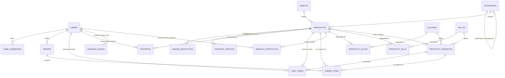

# Esquema Entidad-Relación (E/R) - OutfitGo

Este documento detalla la estructura y relaciones de la base de datos de **OutfitGo** extraída a partir de las migraciones y del volcado de base de datos de producción.

## Diagrama Entidad-Relación (Mermaid)

El siguiente diagrama muestra de forma gráfica las relaciones entre las distintas tablas de la base de datos.

---

## Diccionario de Datos

A continuación se describen las tablas fundamentales del modelo de negocio de OutfitGo:

### 1. Gestión de Usuarios y Direcciones

#### `users`
Almacena los datos de los usuarios registrados, administradores y credenciales de acceso.
* **`id`** (BigInt Unsigned, PK, Autoincremental): Identificador único.
* **`name`** (VarChar 255): Nombre completo del usuario.
* **`email`** (VarChar 255, Único): Correo electrónico del usuario.
* **`email_verified_at`** (Timestamp, Nulo): Fecha de verificación del correo.
* **`password`** (VarChar 255, Nulo): Contraseña encriptada (nulo si accede con Google).
* **`google_id`** (VarChar 255, Único, Nulo): ID de autenticación social de Google.
* **`avatar`** (VarChar 255, Nulo): Enlace al avatar de perfil.
* **`rol`** (VarChar 255, Default 'cliente'): Rol del usuario en el sistema (`admin`, `admin_productos`, `admin_usuarios`, `cliente`).
* **`is_active`** (TinyInt 1, Default 1): Estado de la cuenta (activo/inactivo).
* *Dirección por defecto:* `direccion`, `ciudad`, `provincia`, `codigo_postal`, `telefono` (Campos adicionales para agilizar checkout).
* **`created_at` / `updated_at`** (Timestamp): Fechas de creación y modificación.

#### `user_addresses`
Direcciones adicionales registradas por los usuarios.
* **`id`** (BigInt Unsigned, PK, Autoincremental)
* **`user_id`** (BigInt Unsigned, FK -> `users.id`): Usuario propietario de la dirección.
* **`nombre_direccion`** (VarChar 255): Alias de la dirección (ej: "Trabajo", "Casa").
* **`direccion`**, **`ciudad`**, **`provincia`**, **`codigo_postal`**, **`telefono`** (VarChar 255): Detalles de localización.
* **`es_principal`** (TinyInt 1, Default 0): Indica si es la dirección por defecto del usuario.

---

### 2. Catálogo de Productos

#### `productos`
Contiene la información general de los artículos a la venta.
* **`id`** (BigInt Unsigned, PK, Autoincremental)
* **`marca_id`** (BigInt Unsigned, FK -> `marcas.id`): Marca del producto.
* **`categoria_id`** (BigInt Unsigned, FK -> `categorias.id`): Categoría del producto.
* **`nombre`** (VarChar 255): Nombre en español.
* **`nombre_en`**, **`nombre_fr`** (VarChar 255, Nulos): Traducciones del nombre.
* **`slug`** (VarChar 255, Único): URL amigable del producto.
* **`descripcion`**, **`descripcion_en`**, **`descripcion_fr`** (Text, Nulos): Descripción en español, inglés y francés.
* **`publico`** (Enum: 'hombre', 'mujer', 'infantil', 'unisex'): Público objetivo.
* **`url_imagen_principal`** (VarChar 255, Nulo): Imagen destacada.
* **`galeria`** (JSON, Nulo): Array con rutas de imágenes secundarias.
* **`precio`** (Decimal 10,2): Precio base del producto.
* **`stock`** (Int, Default 0): Stock general de seguridad.

#### `categorias`
Categorías de organización jerárquica para los productos.
* **`id`** (BigInt Unsigned, PK, Autoincremental)
* **`nombre`**, **`nombre_en`**, **`nombre_fr`** (VarChar 255): Nombres en los diferentes idiomas.
* **`slug`** (VarChar 255, Único)
* **`categoria_padre_id`** (BigInt Unsigned, FK -> `categorias.id`, Nulo): Permite subcategorías recursivas.

#### `marcas`
* **`id`** (BigInt Unsigned, PK, Autoincremental)
* **`nombre`** (VarChar 255)
* **`slug`** (VarChar 255, Único)
* **`url_logo`** (VarChar 255, Nulo)

---

### 3. Variaciones de Producto (Stock, Tallas y Colores)

#### `colores`
* **`id`** (BigInt Unsigned, PK, Autoincremental)
* **`nombre`** (VarChar 255, Único): Nombre del color en texto.
* **`hex_code`** (VarChar 255, Nulo): Representación hexadecimal (ej. `#FFFFFF`).

#### `tallas`
* **`id`** (BigInt Unsigned, PK, Autoincremental)
* **`nombre`** (VarChar 255, Único): Nombre de la talla (ej. `XS`, `S`, `M`, `L`, `38`, `39`, etc.).

#### `producto_variantes`
Esta tabla define el inventario real. Relaciona un producto con una combinación concreta de talla y color, y almacena su stock individual.
* **`id`** (BigInt Unsigned, PK, Autoincremental)
* **`producto_id`** (BigInt Unsigned, FK -> `productos.id`)
* **`talla_id`** (BigInt Unsigned, FK -> `tallas.id`)
* **`color_id`** (BigInt Unsigned, FK -> `colores.id`)
* **`stock`** (Int, Default 0): Unidades disponibles de esta combinación exacta.

#### Tablas Pivote Auxiliares:
* **`producto_color`**: Relación de muchos a muchos directa entre Productos y Colores.
* **`producto_talla`**: Relación de muchos a muchos directa entre Productos y Tallas.

---

### 4. Interacciones y Compras

#### `cart_items`
Líneas de carrito de compra activas para los usuarios.
* **`id`** (BigInt Unsigned, PK, Autoincremental)
* **`user_id`** (BigInt Unsigned, FK -> `users.id`)
* **`producto_id`** (BigInt Unsigned, FK -> `productos.id`, Nulo)
* **`producto_variante_id`** (BigInt Unsigned, FK -> `producto_variantes.id`, Nulo)
* **`cantidad`** (Int, Default 1): Cantidad de unidades añadidas.

#### `orders`
Cabecera de pedidos realizados por los clientes.
* **`id`** (BigInt Unsigned, PK, Autoincremental)
* **`user_id`** (BigInt Unsigned, FK -> `users.id`)
* **`total`** (Decimal 10,2): Importe total del pedido.
* **`estado`** (VarChar 255, Default 'pendiente'): Estado del envío (`pendiente`, `procesado`, `enviado`, `entregado`, `cancelado`).
* **Datos de envío para este pedido:** `nombre`, `apellidos`, `telefono`, `direccion`, `ciudad`, `provincia`, `codigo_postal` y `notas`.

#### `order_items`
Líneas de detalle de cada pedido.
* **`id`** (BigInt Unsigned, PK, Autoincremental)
* **`order_id`** (BigInt Unsigned, FK -> `orders.id`): Pedido al que pertenece la línea.
* **`producto_id`** (BigInt Unsigned, FK -> `productos.id`): Producto adquirido.
* **`producto_variante_id`** (BigInt Unsigned, FK -> `producto_variantes.id`, Nulo): Variante específica de talla/color.
* **`cantidad`** (Int): Unidades compradas.
* **`precio_unitario`** (Decimal 10,2): Precio al que se compró en ese instante (para registro histórico).

#### `favorites`
Lista de deseos/favoritos de los usuarios.
* **`id`** (BigInt Unsigned, PK, Autoincremental)
* **`user_id`** (BigInt Unsigned, FK -> `users.id`)
* **`producto_id`** (BigInt Unsigned, FK -> `productos.id`)

---

### 5. Marketing, Historiales y Reseñas

#### `cupones`
Códigos de descuento aplicables.
* **`id`** (BigInt Unsigned, PK, Autoincremental)
* **`codigo`** (VarChar 255, Único)
* **`tipo`** (Enum: 'porcentaje', 'fijo')
* **`valor`** (Decimal 8,2): Importe o porcentaje de descuento.
* **`is_active`** (TinyInt 1, Default 1): Cupón activo/inactivo.

#### `historial_precios`
Registro de cambios en los precios de los productos.
* **`id`** (BigInt Unsigned, PK, Autoincremental)
* **`producto_id`** (BigInt Unsigned, FK -> `productos.id`)
* **`precio`** (Decimal 8,2): Valor del precio en ese instante.

#### `resenas_productos`
Valoraciones y opiniones individuales sobre productos específicos.
* **`id`** (BigInt Unsigned, PK, Autoincremental)
* **`user_id`** (BigInt Unsigned, FK -> `users.id`)
* **`producto_id`** (BigInt Unsigned, FK -> `productos.id`)
* **`puntuacion`** (Int): Escala del 1 al 5.
* **`comentario`** (Text)

#### `resenas_pagina`
Opiniones globales de clientes sobre el sitio web / tienda online.
* **`id`** (BigInt Unsigned, PK, Autoincremental)
* **`user_id`** (BigInt Unsigned, FK -> `users.id`)
* **`puntuacion`** (Int): Puntuación del 1 al 5.
* **`comentario`** (Text)
* **`visible_en_portada`** (TinyInt 1, Default 0): Aprobación para mostrar en testimonios.

---

### 6. Tablas del Sistema (Laravel Core)
Tablas automáticas necesarias para el framework Laravel:
* **`migrations`**: Registro de migraciones aplicadas.
* **`cache` / `cache_locks`**: Gestión de caché persistente y bloqueos de concurrencia.
* **`sessions`**: Persistencia de sesiones de usuario en base de datos.
* **`password_reset_tokens`**: Tokens temporales para recuperación de contraseñas.
* **`personal_access_tokens`**: Tokens de autenticación API de Laravel (Sanctum/Passport).
* **`jobs` / `failed_jobs` / `job_batches`**: Procesamiento asíncrono de tareas en segundo plano.
