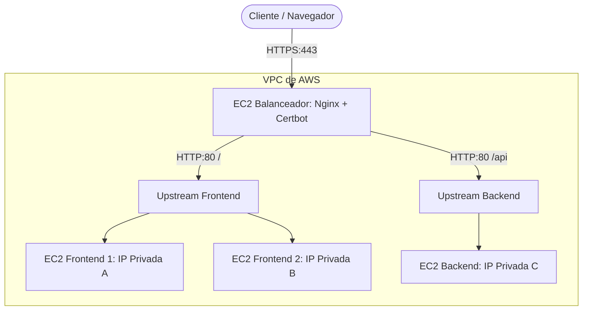

# 🚀 Guía de Despliegue y Operaciones (CI/CD e Infraestructura)

Esta guía documenta los pipelines de integración y despliegue continuo (CI/CD), las configuraciones de producción de los servidores en AWS y la arquitectura planeada del **Balanceador de Carga basado en EC2 (Nginx)**.

---

## 🏗️ 1. Infraestructura de Producción Actual (AWS)

La aplicación está compuesta por contenedores Docker ejecutándose en instancias seguras de Amazon EC2 en una VPC.

*   **Frontend**: Contenedor Docker de Angular expuesto por Nginx (Port 80/443).
*   **Backend**: Contenedor de Laravel (Port 8000) expuesto a través de un proxy local Nginx (Port 80/443).
*   **Base de Datos**: Amazon RDS MySQL (`db-outfitgo.cdoveyyqvrqx.us-east-1.rds.amazonaws.com`).
*   **IP del Servidor Staging/Producción**: `52.4.105.78`

---

## 🔄 2. Automatización CI/CD con GitHub Actions

Tanto el Frontend como el Backend cuentan con flujos automáticos de despliegue que se disparan en cada `push` a la rama `main`.

### 2.1 Despliegue del Frontend
El pipeline compila el proyecto Angular en un contenedor de compilación y transfiere los archivos generados mediante SCP a la ruta del servidor EC2.

#### Archivo de Configuración: `.github/workflows/deploy.yml`
```yaml
name: Deploy Angular Frontend to AWS EC2

on:
  push:
    branches: [ "main" ]

jobs:
  deploy:
    runs-on: ubuntu-latest
    steps:
      - name: Checkout Code
        uses: actions/checkout@v4

      - name: Setup Node.js
        uses: actions/setup-node@v4
        with:
          node-version: 20
          cache: 'npm'

      - name: Install Dependencies
        run: npm ci

      - name: Build Angular Project
        run: npm run build --configuration=production

      - name: Copy to AWS via SCP
        uses: appleboy/scp-action@v0.1.7
        with:
          host: ${{ secrets.SERVER_IP }}
          username: ${{ secrets.SERVER_USER }}
          key: ${{ secrets.SERVER_SSH_KEY }}
          source: "dist/outfit-go-frontend/browser/*"
          target: "/var/www/html/frontend"
          strip_components: 3
```

#### Secretos requeridos en el repositorio Frontend:
*   `SERVER_IP`: La IP de la instancia EC2 (`52.4.105.78`).
*   `SERVER_USER`: El usuario SSH (generalmente `ubuntu`).
*   `SERVER_SSH_KEY`: Clave privada `.pem` completa (incluyendo cabeceras).

---

### 2.2 Despliegue del Backend
El pipeline de Backend se conecta vía SSH al servidor EC2, actualiza el código del repositorio, inyecta variables de entorno críticas y recompila la imagen Docker de producción.

#### Secretos requeridos en el repositorio Backend:
*   `BACKEND_HOST`: IP de la instancia del Backend.
*   `SSH_KEY`: Clave privada SSH.
*   `USER`: Usuario SSH (`ubuntu`).
*   `APP_KEY`: Clave secreta de cifrado de Laravel.
*   `RDS_HOST`: Endpoint del servidor de base de datos RDS.
*   `RDS_PASSWORD`: Contraseña del usuario administrador de la base de datos.
*   `STRIPE_SECRET`: API key privada para pagos de Stripe.
*   `MAIL_USERNAME` / `MAIL_PASSWORD`: Credenciales del SMTP de correo.

---

## ⚖️ 3. Arquitectura Objetivo: Balanceador de Carga EC2 (Nginx)

Como mejora de infraestructura para alta disponibilidad, el objetivo es configurar una instancia EC2 intermedia que actúe como **única puerta de entrada** (Balanceador Nginx) y distribuya la carga de trabajo entre dos servidores idénticos de Frontend.



### 3.1 Beneficios Clave
1.  **Redundancia**: Si una de las instancias del frontend falla o entra en mantenimiento, el balanceador redirige de forma transparente al usuario a la otra.
2.  **Centralización SSL**: El certificado SSL de Let's Encrypt solo se instala en la máquina del Balanceador. Los servidores internos se comunican por HTTP (puerto 80) a través de la red interna privada (VPC), haciendo más rápidos y limpios los despliegues.
3.  **Compatibilidad DuckDNS**: Permite seguir utilizando el subdominio gratuito `outfitgo.duckdns.org` apuntado a la IP Elástica de la máquina Balanceadora.

### 3.2 Pasos Operativos de Configuración (Consola AWS)

#### Paso A: Clonar la instancia de Frontend (Frontend 2)
1. En la consola EC2, selecciona tu servidor Frontend actual.
2. Haz clic en **Actions > Image and templates > Create image** (ej. `ami-outfitgo-frontend`).
3. Una vez disponible la AMI, haz clic en **Launch instance from AMI** para crear **OutfitGo-Frontend-2** con el mismo grupo de seguridad.

#### Paso B: Levantar la máquina Balanceadora
1. Lanza una nueva instancia EC2 pequeña (ej: `t3.nano` o `t3.micro`) con Ubuntu 22.04.
2. Asígnale una **IP Elástica (Elastic IP)** y actualiza tu cuenta de DuckDNS para que apunte a ella.
3. Instala el proxy Nginx y Certbot en ella:
   ```bash
   sudo apt update && sudo apt install -y nginx certbot python3-certbot-nginx
   ```

#### Paso C: Configuración de Nginx en el Balanceador
Crea un archivo `/etc/nginx/sites-available/outfitgo` con el enrutamiento:
```nginx
upstream frontend_servers {
    server 172.31.X.X:80; # IP Privada de Frontend 1
    server 172.31.Y.Y:80; # IP Privada de Frontend 2
}

upstream backend_servers {
    server 172.31.Z.Z:80; # IP Privada del Backend
}

server {
    listen 80;
    server_name outfitgo.duckdns.org;
    return 301 https://$host$request_uri;
}

server {
    listen 443 ssl;
    server_name outfitgo.duckdns.org;

    ssl_certificate /etc/letsencrypt/live/outfitgo.duckdns.org/fullchain.pem;
    ssl_certificate_key /etc/letsencrypt/live/outfitgo.duckdns.org/privkey.pem;

    location / {
        proxy_pass http://frontend_servers;
        proxy_set_header Host $host;
        proxy_set_header X-Real-IP $remote_addr;
        proxy_set_header X-Forwarded-For $proxy_add_x_forwarded_for;
    }

    location ~ ^/(api|admin|storage) {
        proxy_pass http://backend_servers;
        proxy_set_header Host $host;
        proxy_set_header X-Real-IP $remote_addr;
        proxy_set_header X-Forwarded-For $proxy_add_x_forwarded_for;
    }
}
```

#### Paso D: Generar el Certificado SSL en el Balanceador
Ejecuta el comando para autoconfigurar Let's Encrypt:
```bash
sudo certbot --nginx -d outfitgo.duckdns.org --non-interactive --agree-tos -m admin@outfitgo.duckdns.org
```

#### Paso E: Ajuste de Seguridad en EC2
Modifica los Grupos de Seguridad de tus servidores Frontend y Backend originales en la consola de AWS para que **únicamente** acepten conexiones entrantes en el puerto 80 si provienen de la **IP privada del Balanceador**.
